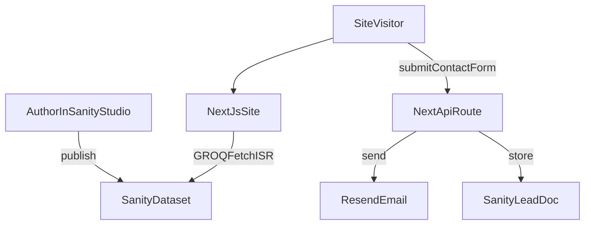

# productivitytech.io build plan (Next.js + Sanity + Vercel)

## Goals and success criteria

- **Affiliate + tool promotion**: editorial content can embed and disclose affiliate links, plus “best for / not for” tool comparisons.
- **SEO + GEO content engine**: every post is structured for search engines and AI answers (clear headings, definitions early, lists, internal linking).
- **First-class products (CPT equivalent)**: your SaaS + Notion templates have dedicated landing pages with conversion CTAs.
- **Lead capture**: “Contact me to build/customize this” appears site-wide and inside content; submissions are **emailed (Resend) and stored in Sanity**.

## Stack and key decisions (locked)

- **Frontend**: Next.js (App Router) + TypeScript + Tailwind.
- **CMS**: Sanity (hosted Studio) + **Sanity MCP** for content ops/automation.
- **Deployment**: **Vercel**.
- **Rendering**: Static-first with **ISR** for content pages.

## Phase 0 — Project bootstrap (half day)

### Frontend

**Deliverables**

- Next.js repo created and running locally.
- Vercel project connected (preview deployments enabled).

### Sanity Studio (hosted)

**Command (your exact init)**

```bash
npm create sanity@latest -- --project g3aw9p5p --dataset production --template clean
```

**Deliverables**

- Sanity Studio initialized and deployed (hosted).
- Roles/tokens set up for:
- **Public read** (frontend fetch)
- **Server write** (storing `lead` documents from the contact form)

## Phase 1 — Content model (Sanity schemas) (1 day)

Create schemas that directly map to your outcomes.

### Core document types

- **`post`** (SEO/GEO blog engine)
- Fields: `title`, `slug`, `excerpt`, `publishedAt`, `updatedAt`, `authors[]`, `categories[]`, `content` (Portable Text), `heroImage`, `affiliateBlocks[]`, `relatedProducts[]`, `seo`.
- **`product`** (CPT equivalent)
- Fields: `name`, `slug`, `productType` (SaaS/Notion/Other), `shortDescription`, `body` (Portable Text), `features[]`, `useCases[]`, `pricing` (free/one-time/subscription + display fields), `primaryCta` (label + url), `secondaryCta` (optional), `seo`.
- **`tool`** (recommended)
- Normalizes “software/apps you promote” separately from affiliate links.
- Fields: `name`, `slug`, `websiteUrl`, `description`, `logo`, `pricingNotes`, `pros[]`, `cons[]`, `bestFor[]`, `notFor[]`.
- **`affiliateLink`** (reusable)
- Fields: `label`, `vendor`, `url`, `disclosureText`, `couponCode` (optional), `notes`.
- **`category`** (taxonomy)
- **`page`** (home/about/contact/legal)
- **`lead`** (stores submissions)
- Fields: `name`, `email`, `message`, `sourceUrl`, `intent` (consulting/product/support), `createdAt`, `status` (new/replied/closed).

### Content blocks (Portable Text)

- **CTA block**: headline, copy, button label, button link, optional scheduling link.
- **Affiliate block**: tool reference + affiliate link reference + disclosure.
- **Comparison block**: A vs B structure for GEO.
- **Product callout**: product reference + mini pitch.

**Deliverable**

- Schemas implemented, validated, and used to create 1–2 sample entries.

## Phase 2 — Frontend structure (App Router) (1–2 days)

### Routes

- `/` (conversion-optimized home)
- `/blog` + `/blog/[slug]`
- `/products` + `/products/[slug]`
- `/categories/[slug]` (optional; useful for internal linking)
- `/contact`
- `/about`
- `/legal/affiliate-disclosure` + `/legal/privacy`

### Data fetching and caching

- GROQ queries via a `sanity` client module.
- Static-first pages with ISR (`revalidate`) + `generateStaticParams()` for slugs.

### Rendering

- Portable Text renderer with custom components for:
- headings (enforce good H2/H3 structure)
- CTA blocks
- affiliate/tool blocks
- comparison blocks
- internal links

**Deliverable**

- Posts and product pages render cleanly and are easy to author in Sanity.

## Phase 3 — Conversion and lead capture (1 day)

### Contact UX

- Global CTA entry points:
- site header button (“Work with me”)
- in-article CTA block
- product page primary CTA + consulting CTA

### Form pipeline (Resend + Sanity)

- Next.js route handler receives form submission.
- Server validates, rate-limits, and:
- sends an email via Resend
- writes a `lead` document to Sanity

**Deliverable**

- Lead submission takes < 30 seconds and reliably produces email + CRM-like record in Sanity.

## Phase 4 — SEO + GEO hardening (1 day)

### SEO fundamentals

- Next.js Metadata API (title/description/canonical)
- Open Graph + Twitter cards
- `sitemap.xml` + `robots.txt`
- RSS feed for blog (optional)
- Structured data where appropriate (Article/Product)

### GEO (AI answer optimization) checklist

- In each post: definition early, “best for / not for”, comparisons, bullet lists, clear conclusion.
- Strong internal linking: tool ↔ post ↔ product.

**Deliverable**

- Lighthouse/SEO basics pass; content layout is AI-citable.

## Phase 5 — Initial content + launch (1–3 days)

### Minimum viable content set

- 3 posts targeting specific queries
- 1–2 product pages (Notion template + SaaS)
- Homepage + About + Contact + Legal pages

### Launch

- Vercel production deploy
- Connect domain
- Verify indexing assets (sitemap/robots/canonicals)

**Deliverable**

- Public site that can rank, sell, and capture leads.

## How Sanity MCP fits into the workflow

- Use MCP to:
- generate/validate content entries (drafts, outlines, metadata)
- bulk-create tool/product entries
- enforce schema-required fields before publishing
